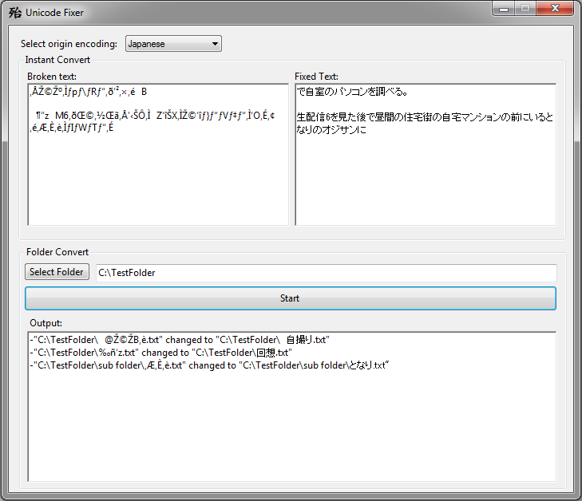

# Unicode Fixer
This program will let you restore filenames that were unicode and badly converted to utf-8.
Requires .NET Framework 4.7.2

## Features

- Select between Japanese and Chinese encoding.
- Instant text restore.
- Rename all (bad name) files in selected folder.

## Preview

